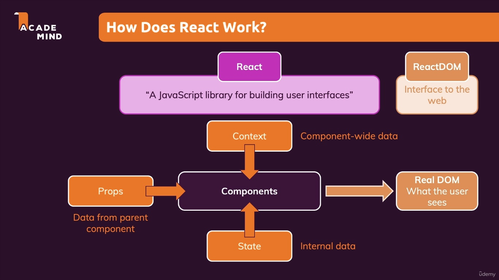

# How Does React Work

Components:

- props: data from parent component
- state: internal data
- context: component-wide data

Real DOM:

- Components: what users see

## Re-evaluating(execute functional) components !== Re-redering the DOM

- Components will be re-evaluated whenever props, state or context changes
- React executes component functions
- Changes to the real DOM are only made for differences between evaluations

Re-evaluation refers to execute functional components when props, state and context changes. Re-redering refers to update real DOM when difference after re-evaluation.

[React re-render vs function re-evaluation](https://stackoverflow.com/questions/66860324/react-re-render-vs-function-re-evaluation)

## React handle state updates

the new state will no instantly updated just after running setState() function. Instead, React schedules a state update with new value after calling setState() function.

once the new state is active or is processed, React will re-evaluate the component => re-run the component function

once the component has re-run then we have the latest state
