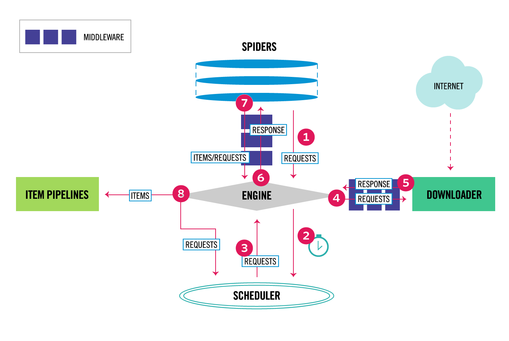
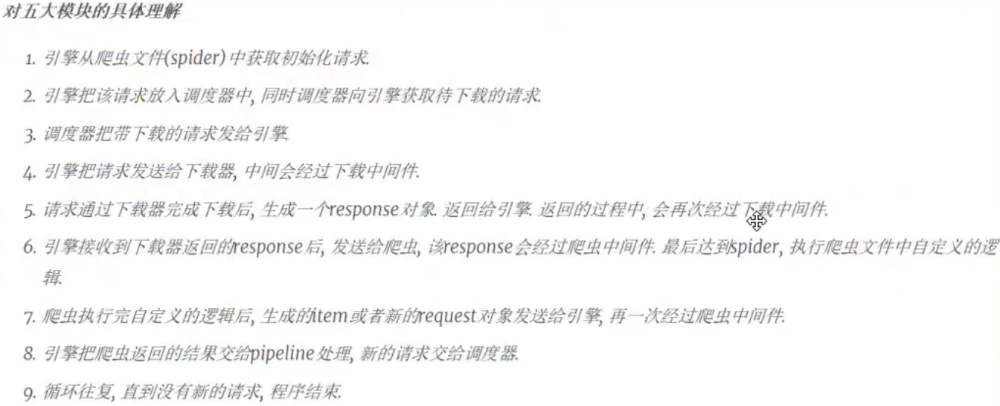

# `Scrapy` 第一节 笔记: 架构，工作流

## 为什么用 `Scrapy`

`Scrapy = requests + re + xpath + multi-threads`

基于异步 `twisted` 的爬虫框架

## `Scrapy` 中编写和运行一个爬虫需要如下步骤

- 使用 `scrapy startproject project_name` 来[创建爬虫项目](https://docs.scrapy.org/en/latest/topics/commands.html#creating-projects)
- 使用 `scrapy genspider mydomain mydomain.com` 定义爬虫类 `spider.py` 文件，继承自 `scrapy.Spider`
- `parse()`方法中重写页面的解析和抓取逻辑
- 使用 `scrapy runspider .spiderpy` 运行爬虫程序(爬虫目录下)

## `Scrapy` 爬虫启动原理（架构）

[Docs](https://docs.scrapy.org/en/latest/topics/architecture.html#architecture-overview)



### The data flow in `Scrapy` is controlled by the execution engine, and goes like this:

1. The [Engine](https://docs.scrapy.org/en/latest/topics/architecture.html#scrapy-engine) gets the initial Requests to crawl from the [Spider](https://docs.scrapy.org/en/latest/topics/architecture.html#spiders).

2. The Engine schedules the Requests in the [Scheduler](https://docs.scrapy.org/en/latest/topics/architecture.html#scheduler) and asks for the next Requests to crawl.

3. The Scheduler returns the next Requests to the Engine.

4. The Engine sends the Requests to the [Downloader](https://docs.scrapy.org/en/latest/topics/architecture.html#component-downloader), passing through the [Downloader Middlewares](https://docs.scrapy.org/en/latest/topics/architecture.html#component-downloader-middleware) (see `process_request()`).

5. Once the page finishes downloading the Downloader generates a Response (with that page) and sends it to the Engine, passing through the Downloader Middlewares (see `process_response()`).

6. The Engine receives the Response from the Downloader and sends it to the Spider for processing, passing through the [Spider Middleware](https://docs.scrapy.org/en/latest/topics/architecture.html#component-spider-middleware) (see process_spider_input()).

7. The Spider processes the Response and returns scraped items and new Requests (to follow) to the Engine, passing through the Spider Middleware (see `process_spider_output()`).

8. The Engine sends processed items to [Item Pipelines](https://docs.scrapy.org/en/latest/topics/architecture.html#component-pipelines), then send processed Requests to the Scheduler and asks for possible next Requests to crawl.

9. The process repeats (from step 3) until there are no more requests from the Scheduler.

一般来说 在使用 `Scrapy` 框架时，需要自己编写的代码是 `Spiders` 和 `Item Pipelines` 这两个 components。

### `Scrapy` Workflow 具体理解



## `Scrapy` 框架的主要模块

### Engine

`Scrapy` 核心，主要负责控制和串联各个组件，保证数据流的正常运转

### Scheduler

负责管理请求，过滤请求，输出请求 去重请求等

### Downloader

负责从网络中获取数据资源，封装结果为 `Response` 对象

### Spiders

爬虫模块

- 构造请求

start_urls => Request objects

```python
def start_requests(self):
    if not self.start_urls and hasattr(self, 'start_url'):
        raise AttributeError(
            "Crawling could not start: 'start_urls' not found "
            "or empty (but found 'start_url' attribute instead, "
            "did you miss an 's'?)")
    for url in self.start_urls:
        yield Request(url, dont_filter=True)
```

- 解析数据

处理 `downloader` 返回的 Response 对象，进行清洗，解析数据 => 数据对象即 items => Item Pipelines

### Pipeline

负责输出/保存数据，自定义输出等格式和目标地址

### Request， Response 和 Items

#### Request

- callback：回调函数，表示当前 URL 的响应交给哪个方法执行
- meta：在不同方法之间传递数据，默认会带有下载延迟和请求深度
- dont_filter：默认 False，表示过滤
- method：请求方法
- headers：请求头
- cookies：cookie 字典
- body：json 字符串，post 的请求体

#### Response

1. 常用属性

- url：当前响应的请求 url
- request.url：发起请求的 url
- headers；响应头
- request.headers：请求头
- body：响应体，bytes 类型
- status：响应状态码
- text：响应体的文本，str 类型
- meta：request 请求传递过来的参数

2. 常用方法

- json()： 响应如果是 json 类型，可以改方法解析 json 数据为字典对象
- urljoin()： 拼接 url
- xpath()： xpath 提取数据
- css()： css 提取数据
- follow(): 继续向下发起请求，不需要完整的解析 url，scrapy 会帮你解析

#### Items

Items 提供了一个可以读取，写入，修改的数据字典
拥有字典相同的操作
申明字段：定义好抓取内容的字段名，将抓取的数据填充到 item 即可

在 `items.py` 中定义字段

```python
class YrxSpiderItem(scrapy.Item):
    # define the fields for your item here like:
    # name = scrapy.Field()
    list_html = scrapy.Field()
    detail_html = scrapy.Field()
    title = scrapy.Field()
```

使用

```python
...
item = YrxSpiderItem()
item['list_html'] = msg
item['title'] = title
...
```

## `Scrapy` 的执行入口

scrapy.cmdline => execute

```python
# from scrapy.cmdline import execute

# if __name__ == '__main__':
#     execute('scrapy crawl yrx'.split())


from scrapy.crawler import CrawlerProcess
from scrapy.utils.project import get_project_settings

# 获取配置.
settings = get_project_settings()
process = CrawlerProcess(settings)
process.crawl('yrx')
process.start()
```
