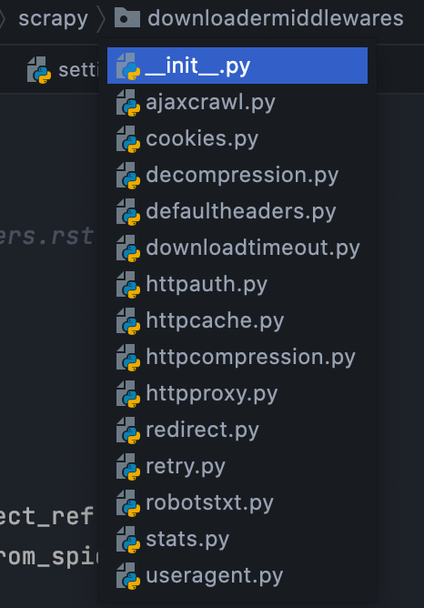
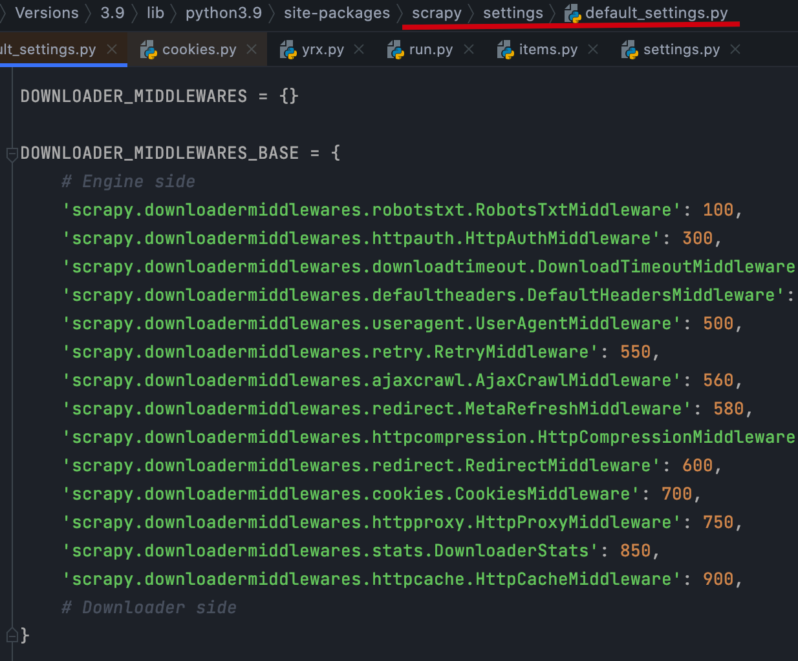

# `Scrapy` 第二节 视频笔记: 下载中间件

## 下载器中间件概述

`MiddlewareManager`基类，派生出如下子类

- `SPIDER_MIDDLEWARES`
- `DOWNLOADER_MIDDLEWARES`
- `ITEM_PIPELINES`
- `EXTENSIONS`

## 如何使用


- 下载中间件是用于处理 scrapy 的 request 和 response 的，图中 4，5 两步.
- 在 `settings.py` 文件设置 `DOWNLOADER_MIDDLEWARES` 这个字典，才可以使用下载中间.

  ```python

  # Enable or disable downloader middlewares
  # See https://docs.scrapy.org/en/latest/topics/downloader-middleware.html
  #DOWNLOADER_MIDDLEWARES = {
  #    'yrx_spider.middlewares.YrxSpiderDownloaderMiddleware': 543,
  #}

  ```

- 可以全局的修改一些参数, 如代理 ip. headers 等.

- 数字越小, 越靠近引擎, 数字越大越远离引擎, 越靠近下载器.

- 如果想要关闭: 则将对应的 key 的 value 值设置为 none.

- 每一个下载中间件都是一个 python 的类. 它里面定义了一些方法.

### 默认的下载器中间件列表



### 默认的下载器中间件配置



### 重要的方法

1. `from_crawler`: 中间件的入口. 它接受 `Crawler` 实例作为参数, 会返回一个中间件的实例.

2. `process_request`: 经过下载中间件的每个 `request` 请求会调用此方法. 接收 2 个参数: (`request`: 当前处理的 resquest 请求; `spider`: 发出此 request 请求的爬虫). 只能有以下 3 个返回值:

- `none`: scrapy 将继续处理这个请求.执行中间件链中的下一个. 直到全部处理完毕.
- `response`: scrapy 不会再调用其他的 `process_request` 或 `process_exception` 方法了, 它将直接返回该 `response`.
- `request`: scrapy 将停止调用 `process_request` 方法. 并重新调度返回的这个请求.
- 除以上 3 个返回值之外, 可以抛出 `IgnoreRequest` 异常. 则激活的下载中间件的 `process_exception` 方法会被调用,如果没有任何一个方法处理该异常，则 request 的 errback(Request.errback)方法会被调用,如果没有代码处理抛出的异常,则该异常被忽略且不记录.

代理 => request.meta['proxt']

3. `process_response`: 通过下载中间件的每一个 `response` 会调用该方法. 接收 3 个参数(`request`; `response`: 当前处理的 `response` 对象; `spider`), 只能有以下 2 个返回值:

- `response`: 可以与传入的 `response` 相同，也可以是全新的对象, 该 `response` 会被在链中的其他中间件的 `process_response` 方法处理.
- 返回一个 `Request` 对象,则中间件链停止,返回的 `request` 会被重新调度下载.处理类似于 `process_request()` 返回 `request` 的时候一样.
- 如果其抛出一个 `IgnoreRequest` 异常,则调用 request 的 errback(Request.errback)

4. `process_exception`: 处理异常. 当下载异常或 `process_request` 抛出异常.此方法会被调用. 有 3 个返回值:

- `none`: scrapy 会继续处理该异常, 执行其他中间件中的 `process_exception` 方法.
- `response`: 则会调用中间件链中的 `process_response`, 将不会再继续调用 `process_exception` 方法.
- `request`: 则该请求会被重新调度下载.
